Url: http://proudsmartdeploy.s3-website-ap-southeast-2.amazonaws.com/

GitHub React: https://github.com/brucemcclure/ProudSmart-Front

Github Express: https://github.com/brucemcclure/ProudSmart-Back

Problem identification and Solution:
Our client is the CFO of Proud Smart technologies, an incredibly successful internet of things company based out of China. Proud Smart is planning on creating an internal education platform in the very near future. Our team was tasked with creating the proof of concept for this web app, this is to demonstrate to the company that the concept is possible. As such the aesthetic appeal of the site was secondary to the core functionality of the site. That is to say, there are three user types; admin, educator and user. The Admins main function is to approve and edit courses as well as approve applications to become a teacher. The educators main function is to create new courses. The users main function is to buy and use the courses.
The solution was the Proud Smart learning platform which fulfilled the mvp criteria mentioned above.

User stories for the application:

Standard user and Educators journey:
A workflow diagram of the user journey/s:
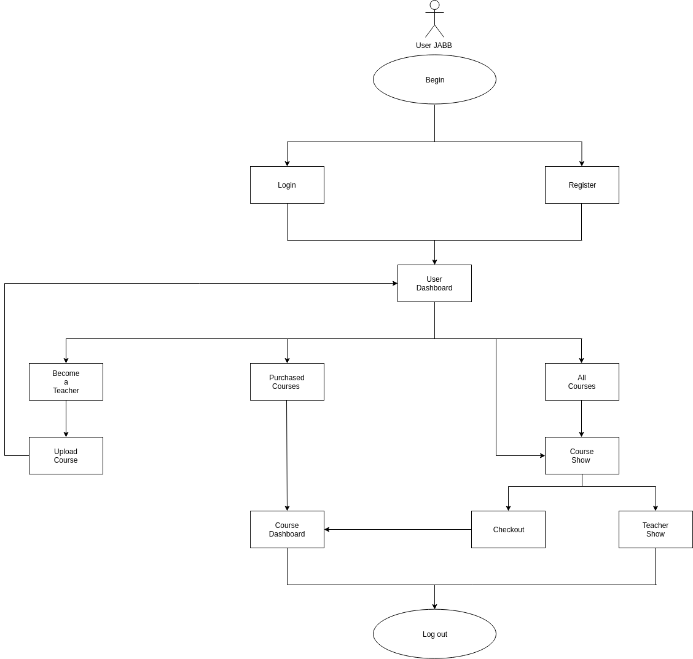

A admin diagram of the user journey:
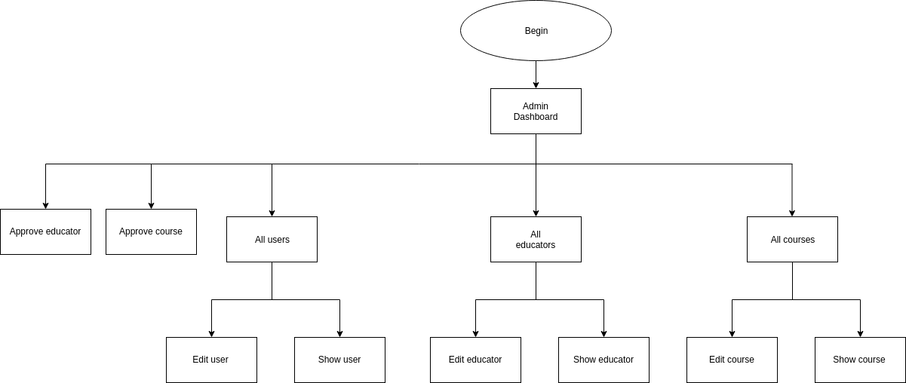

Wireframes for all main pages of your app

User Wireframes:
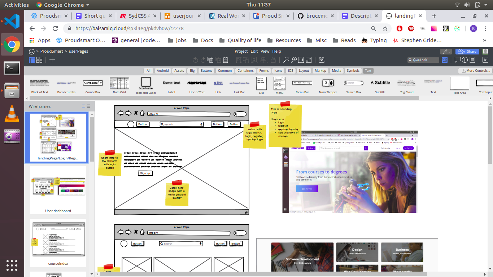

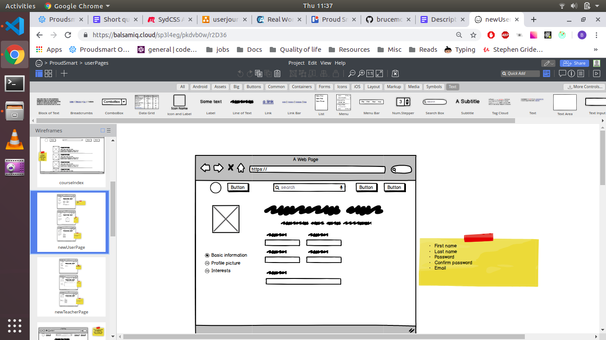
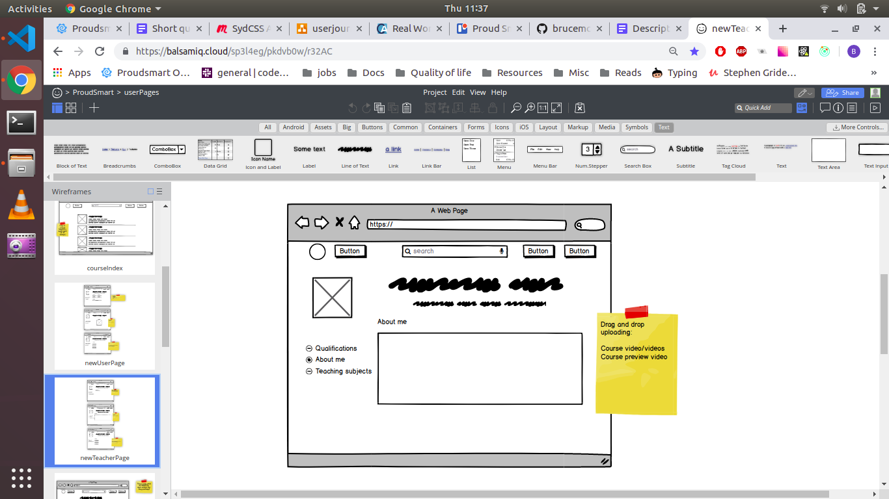
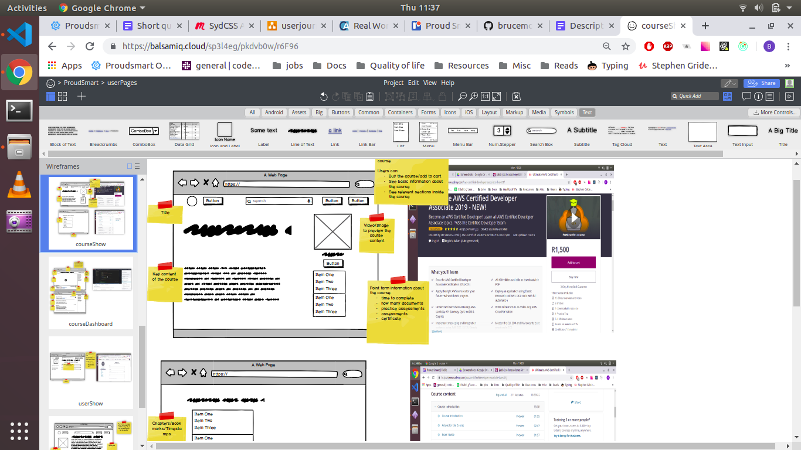

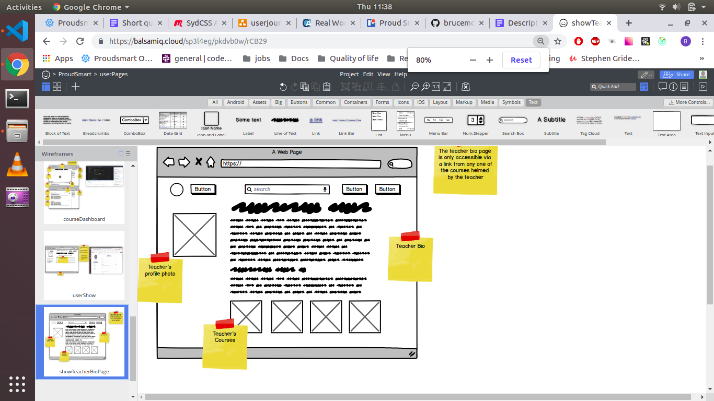

Educator Wireframes:
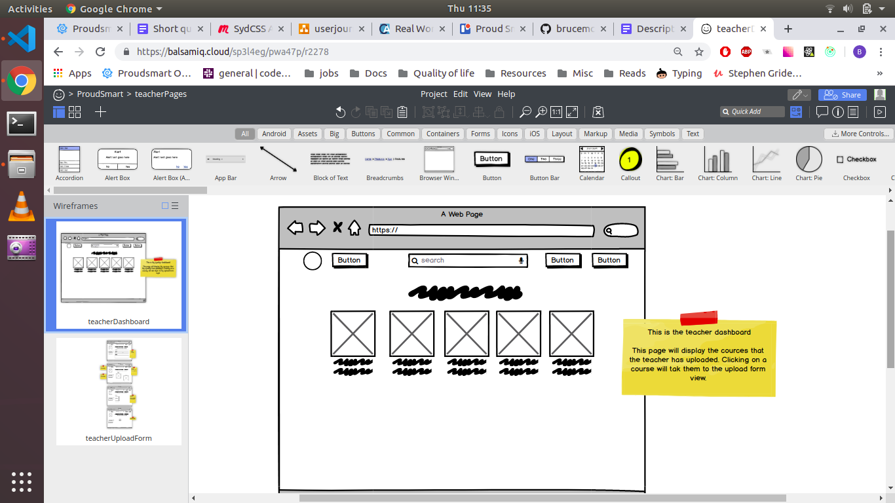
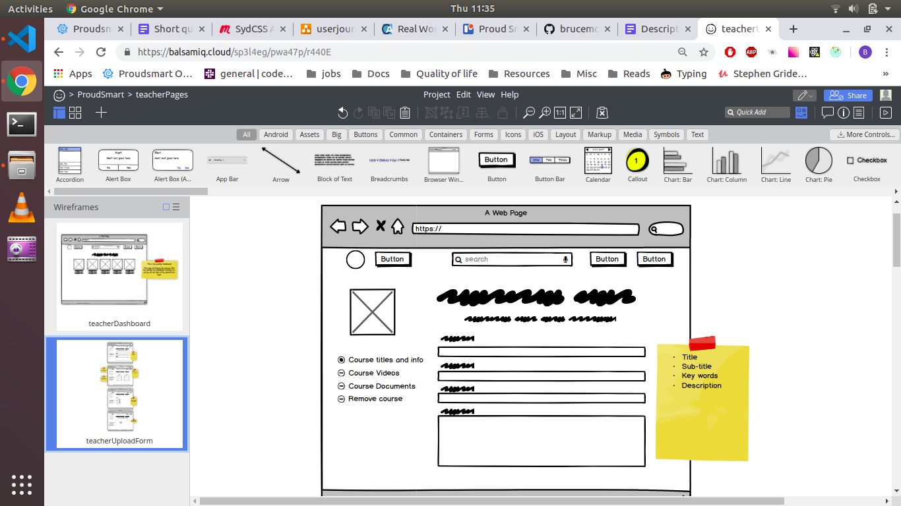
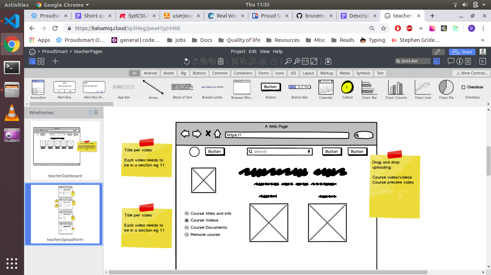
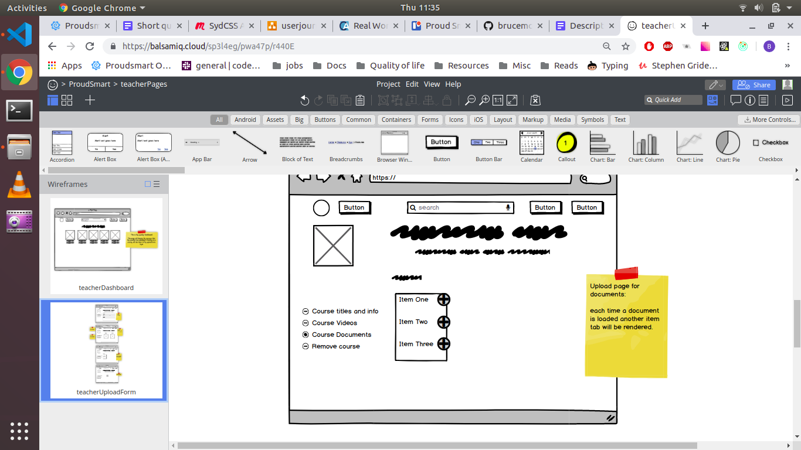

admin Wireframes:
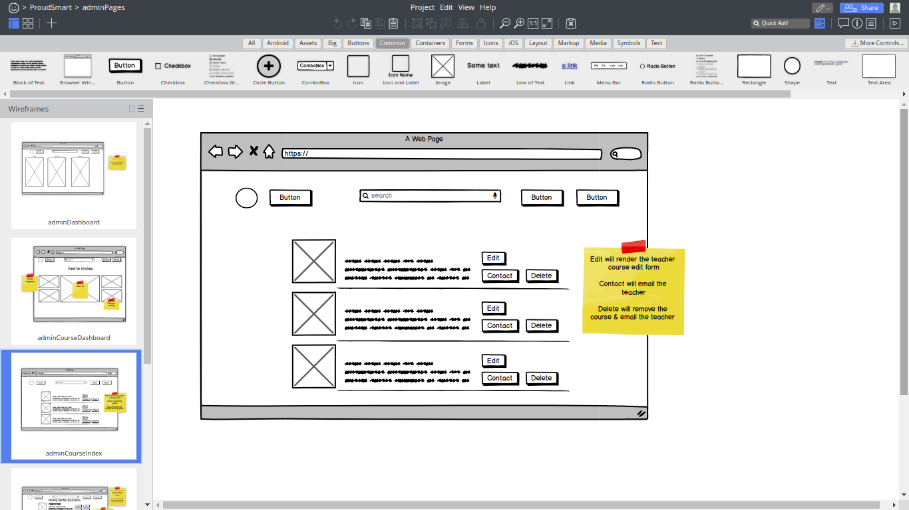
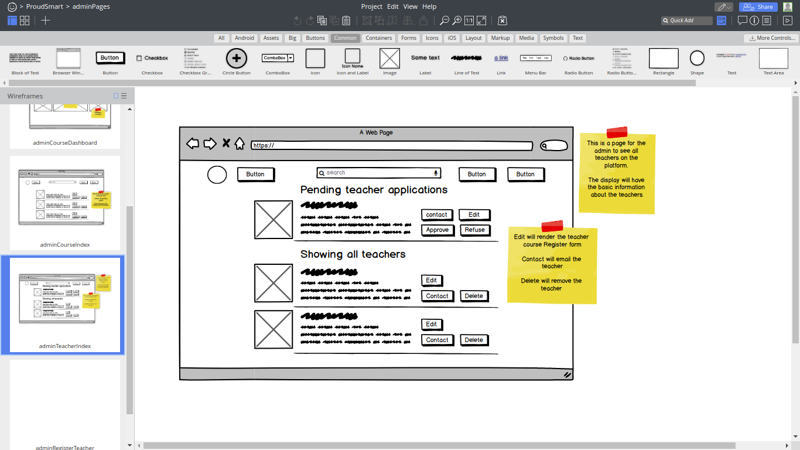

Entity Relationship Diagram (ORD)

Project plan and effort estimation

Data Flow Diagram
OO design documentation
