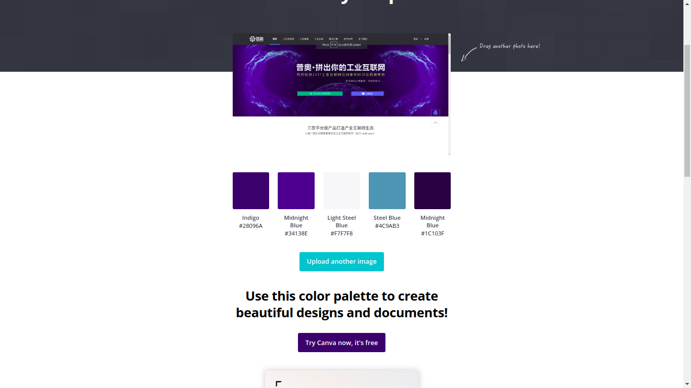
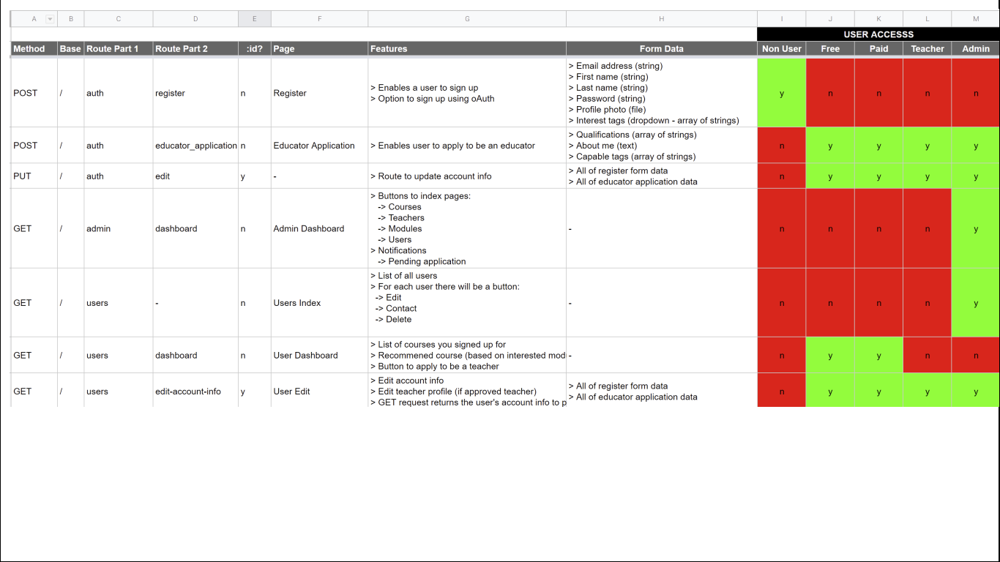
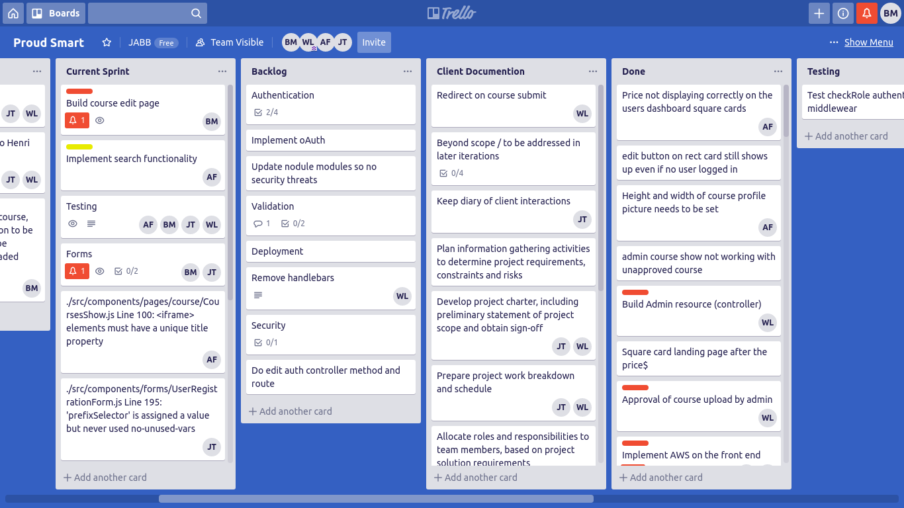
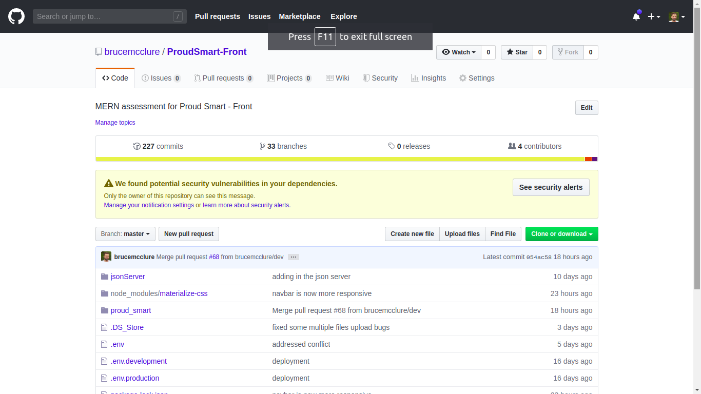
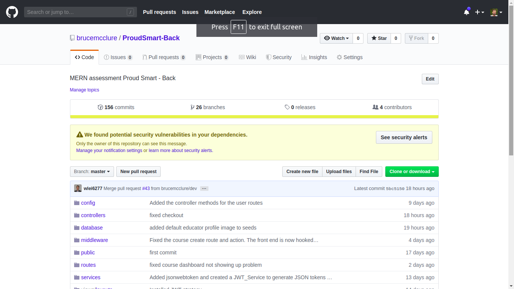
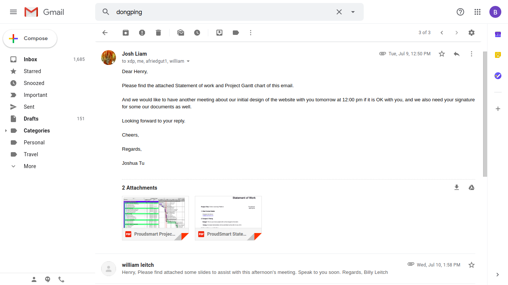
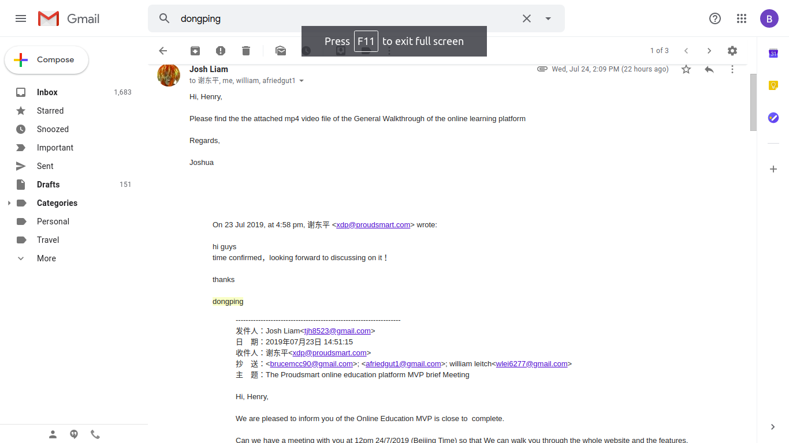

# README Proud Smart Learning Platform

link (URL) to published App:

- Url: http://proudsmartdeploy.s3-website-ap-southeast-2.amazonaws.com/

Links to GitHub repository:

- GitHub React: https://github.com/brucemcclure/ProudSmart-Front
- Github Express: https://github.com/brucemcclure/ProudSmart-Back

Our client is the CFO of Proud Smart technologies, an incredibly successful internet of things company based out of China. Proud Smart is planning on creating an internal education platform in the very near future. Our team was tasked with creating the proof of concept for this web app, this is to demonstrate to the company that the concept is possible. As such the aesthetic appeal of the site was secondary to the core functionality of the site. That is to say, there are three user types; admin, educator and user. The Admins main function is to approve and edit courses as well as approve applications to become a teacher. The educators main function is to create new courses. The users main function is to buy and use the courses.

The tech stack used for the app was MongoDB, ExpressJs, ReactJs and NodeJs. Peripheral and third party services include AWS, Heroku, GitHub, Git, Trello.

### Deployment and available scripts:

### `npm start`

Runs the app in the development mode. 
Open [http://localhost:3000](http://localhost:3000) to view it in the browser.

The page will reload if you make edits. 
You will also see any lint errors in the console.

### `npm run build`

Builds the app for production to the `build` folder. 
It correctly bundles React in production mode and optimizes the build for the best performance.

The build is minified and the filenames include the hashes. 
Your app is ready to be deployed!

See the section about [deployment](https://facebook.github.io/create-react-app/docs/deployment) for more information.

### User stories for the application:

### Standard user and Educators journey:

A workflow diagram of the user journey/s:

### A admin diagram of the user journey:

## Design Porcess:

The design process included drawing inspiration from other learning platforms such as coursera and udemy. Thereafter wireframes were constructed as seen in the images below, alongside the pages from which they were inspired. A screenshot was processed through Canvas colour palette generator and implemented into the build.

## Colour palette:

Wireframes for all main pages of your app

## User Wireframes:

The users main function is to buy and use the courses.

### Educator Wireframes:

The educators main function is to create new courses.

### Admin Wireframes:

The Admins main function is to approve and edit courses as well as approve applications to become a teacher

## Object Relational Diagram (ORD)

## Project plan and effort estimation

The project plan and effort estimation was based on the below gantt chart.

### Data Flow Diagram

### OO design documentation

## Details of Project Management & Planning process

Time line planning was conducted by consulting the gantt chart.

API end point documentation:

### Project managment

## Trello management

## Github colaboration

### Express

### React

## Client communication:

Client communication was conducted both by email and by skype meetings.

# Answers to short questions

## What are the most important aspects of quality software?

This question will be split into two sections, the first being the important aspects from a development perspective and then from the user's perspective.

A development perspective:
First and foremost, quality software needs to strive for simplicity. That is not to say that software needs to be basic, but rather that large complicated projects need to broken down to their simple and understandable components. It is the marriage of the principle of single responsibility and the separation of concerns. The separation of concerns will lead to four additional critical aspects of quality software; speed of production, ability to change (agile), automated quality assurance ,and the ability to collaborate in numbers.
The speed of production will initially be hampered because of the extensive planning required however the actual time spent on programming will be significantly shortened due to abstracting away the complexity. The speed of production is obviously advantageous to both the user as well as the team building the product.

The agility of the software is greatly increased due to the separation of concerns. Entire features can be changed or removed from the program without causing a critical error. This means that completely new features can be put into production without influencing the rest of the application.

Automated unit testing can be implemented on the smallest aspects of the program more easily because the program will be separated out into its smallest components already.
The ability to collaborate in large numbers is made easier due to the readability of the code. Well written, eloquent code enables developers to get to work immediately without having to decipher files with hundreds of lines in it.

The users perspective is, of course, slightly different. The most important aspects of quality software are useability and reliability. The software needs to be able to fulfill the needs of the user by working in the way it is intended and in a way that the customer can use easily.

## Libraries

1. Express - Was used to run the server
   https://www.npmjs.com/package/express

2. Mongoose - Wrapper around MongoDB. It is an Object modeling tool designed to work asynchronously.
   https://www.npmjs.com/package/mongoose

3. Passport - Authentication and authorization. Passport does not mount routes or assume any particular database schema, which maximizes flexibility making it the correct choice for this project.
   https://www.npmjs.com/package/passport

4. Passport-local-mongoose - Passport-Local Mongoose is a Mongoose plugin that simplifies building username and password login with Passport.
   https://www.npmjs.com/package/passport-local-mongoose

5. jsonwebtoken - used to generate JWT which in turn is used for authentication purposes.
   https://www.npmjs.com/package/jsonwebtoken
   Celebrate - celebrate is an express middleware function that wraps the joi validation library.
   https://www.npmjs.com/package/celebrate

6. Multer - middleware for handling form data, used to handle file types
   aws-skd - Provides JavaScript objects for AWS services including Amazon S3
   https://www.npmjs.com/package/aws-sdk

7. React - front end library for building single page applications. Which greatly improves performance.
   https://www.npmjs.com/package/react

8. React-router-dom - DOM bindings for React Router
   https://www.npmjs.com/package/react-router-dom
   React-player - video playback
   https://www.npmjs.com/package/react-player

9. Redux - Redux is a predictable state container for JavaScript apps which manages global state store.
   https://www.npmjs.com/package/redux

10. Redux-form - A very good package to handle form state. It also has solutions for multi page forms and form arrays
    https://www.npmjs.com/package/redux-form

11. Axios - handles HTTP requests between the express app and react.
    https://www.npmjs.com/package/axios

12. Redux-thunk - extends Redux Actions by handling functions instead of just objects
    Materialize - styling library
    https://materializecss.com/

13. Ant design - component library
    https://ant.design/

## A team is about to engage in a project, developing a website for a small business. What knowledge and skills would they need in order to develop the project?

In order to engage in a project to develop a website for a small business a team will need to address at least five different aspects of development; the code base, a source of truth, Team management, communication, UI/UX.

Team management and the approach to software development will need to be decided upon on the very first day. The current paradigm is to use the waterfall approach to software development. This is a vital skill to have in modern software development
Every software development project will require constant communication. Whether that means sitting at the same desk and being able to speak directly to each other or using slack etc. The team will need to establish a line of communication during their first meeting. The industry standard is currently slack.

The technologies used to build the site are of paramount importance. At a very basic level the team or at least one member of the team will need to understand HTML and CSS in order to build a static website. Of course, if there are any additional languages or frameworks they will be included on this list.

The members of the team that will be writing the code will need to have a sound understanding of source control. Currently the industry standard is Git and Github. Using these technologies will improve the production process because it will allow different team members to work on different features of the website concurrently.

Finally and arguably most importantly the team will need a collection of wireframes, user stories, user flow and mock ups to have a common goal to work towards and stay on track. While these ‘blueprints’ for the website are vitally important for the front end user interface and user experience they also influence how the back end or server is designed.

## Within your own project what knowledge or skills were required to complete your project, and overcome challenges?

To complete our project our team required the skills and knowledge to implement a MERN stack application. That is to say that MongoDB, ExpressJs, ReactJs and NodeJs were the frameworks used to build the web application and therefore, at a bare minimum, an understanding of all four were essential.

In order to be able to eloquently implement the aforementioned frameworks knowledge and skills of coding languages such as JavaScript, CSS, HTML, and JSX are also required. API
Our knowledge of coding libraries also proved very important as we used many different libraries in the development of our site. Libraries such as Passport, Material UI, ant, jsonwebtoken, Mongoose, celebrate, etc our Skills and knowledge when it came to the deployment of our site was also important. Heroku, MongoDB Atlas and AWS S3 where all used and where each important in overcoming the challenge of deploying our website.

One of the most interesting challenges we encountered was api documentation. The team of four was divided into a front end team and a back end team. The front end team used a local json server to fake the different end points and correctly display the data to the screen. The back end team was simultaneously working on the real end points to be accessed at a later stage. Unfortunately despite our best efforts the integration between the real apis and the react app was not seamless and we ran into several teething issues. In future we will use “swagger” to document our apis.

Evaluate how effective your knowledge and skills were this project, using examples, and suggest changes or improvements for future projects of a similar nature?
Our knowledge and skills surrounding the MERN stack were sound at the beginning of the project, however this project was the first time we used these technologies to build a project from the ground up so there were some teething issues. As an evaluation of our knowledge and skills we would consider ourselves to be at the level of a mid level developer.

Upon commencement of the project the decision was made to tackle a problem we knew very little about i.e. video streaming from an S3 bucket. Considering our lack of knowledge on the subject we managed to incorporate this feature into our project and have a fully functional product. Considering our lack of knowledge on the subject one could objectively say that our knowledge and skills greatly increased with regards to this. That said, because the implementation of this feature was so time consuming I would recommend exploring the youtube API instead and using the private or unlisted features to protect the educators IP. As an evaluation of our skills and knowledge of amazon web services we would say we achieved a professional level of efficiency.

Considering the short time period provided to build the project, we were unable to fulfill all of our clients features. Some features we would like to see implemented in the future are:

- Search functionality
- This would be the first feature to implement as it would be difficult to navigate the site without it.
- Disable the video download ability: This is a consideration for video
- Extend validation to video and picture upload instead of using defaults.
- Add a feature forum for Q/A for courses.
- Add a shopping cart
